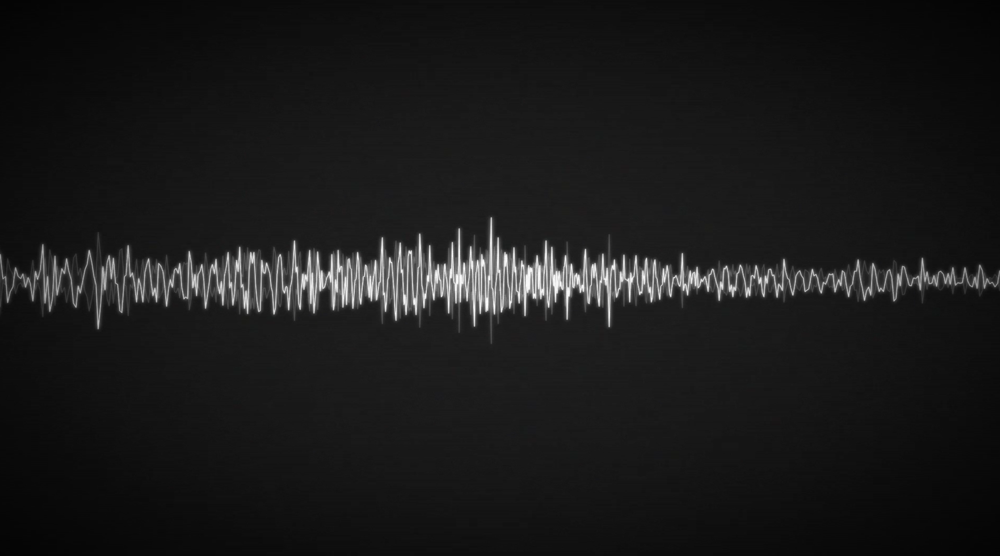

# video-waves


A Python CLI that turns audio files into waveform videos. Built for Apple Silicon with hardware-accelerated encoding and a cold, industrial aesthetic — white waveforms, mirrored shadows, grain and scanlines.

Default output is 1440p at 60fps. Audio is muxed directly from the source file with no quality loss.

## Requirements

- Python 3.8+
- FFmpeg — `brew install ffmpeg`

```bash
pip install librosa numpy moviepy opencv-python
```

## Usage

```bash
# Single file
python3 visualizer.py "/path/to/audio.mp3"

# Batch — processes all audio files in a folder
python3 visualizer.py "/path/to/music_folder"
```

**Options**

| Flag | Default | Description |
|------|---------|-------------|
| `-d` | full | Duration limit in seconds |
| `--fps` | 60 | Framerate |
| `--width` / `--height` | 2560x1440 | Resolution |
| `--out-dir` | same as input | Output directory |

Supported formats: `.mp3` `.aif` `.aiff` `.wav` `.flac`

## Configuration

Edit the `CFG` dict at the top of `visualizer.py`.

| Key | Description |
|-----|-------------|
| `zoom_peak` | Amplitude multiplier at the centre of the frame (the "now" position). Higher = more dramatic focal point |
| `zoom_sigma` | Width of the gaussian zoom bell. Lower = tighter, more concentrated |
| `fisheye_k` | Barrel distortion strength. `0` = disabled |
| `window_sec` | Seconds of audio visible on screen at once |
| `grain_intensity` | Noise grain strength (0–12) |
| `glow_weight` | Glow intensity on loud transients |
| `vignette_power` | Edge darkening falloff |
| `scanline_alpha` | CRT scanline opacity (0 = off) |

## How it works

The render pipeline has two stages. First, MoviePy generates the video track using VideoToolbox hardware encoding — librosa drives the waveform visuals but never touches the output audio. Then ffmpeg muxes the original audio source directly into the final container as AAC-LC 320k 48kHz stereo, preserving the full quality of the source file.

The waveform window is centred on the current playhead, so what you see at the centre of the frame is exactly what you are hearing. A gaussian amplitude curve magnifies the "now" position and tapers toward the edges.
